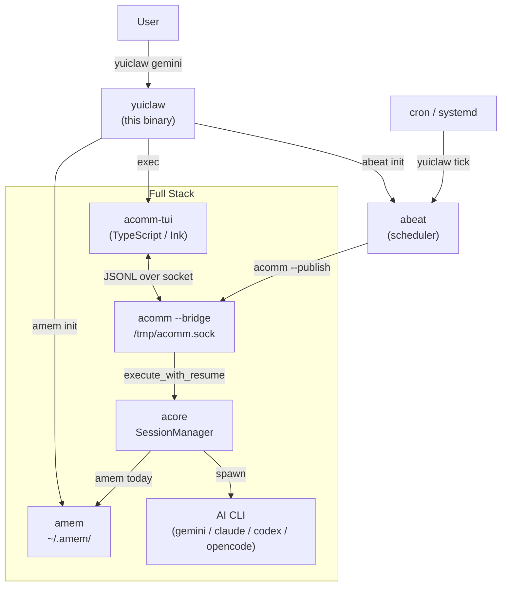

# yuiclaw

Integrated entry point for the `a*` AI assistant stack.

`yuiclaw` is a thin orchestration layer that connects `amem`, `abeat`, `acomm`, and `acore` into a single, stateful AI assistant experience. It initializes memory and the scheduler, then hands off to the interactive TUI — all with one command.

- **Single Entry Point**: `yuiclaw` (or `yuiclaw start`) boots the full stack.
- **Persistent Memory**: Context and activity logs survive across sessions via `amem`.
- **Proactive Heartbeat**: `abeat` triggers scheduled check-ins even without user input.
- **Real-time TUI**: `acomm-tui` provides a multiline, CJK-aware chat interface.
- **Tool-Agnostic**: Switch between Gemini, Claude, Codex, and OpenCode at runtime.
- **Customizable Persona**: The AI assistant identity is configured in `~/.amem/agent/IDENTITY.md` — the bundled "YuiClaw" character is just a default.

## Screenshots

[](https://gyazo.com/90c2c92c812ae79e2a223b11ca788049)

## Prerequisites

All components must be available in `PATH`:

| Component | Role |
|---|---|
| [amem](https://github.com/yuiseki/amem) | Agentic Memory — Markdown-based local context store |
| [abeat](https://github.com/yuiseki/abeat) | Agentic Heartbeat — periodic job runner |
| [acomm](https://github.com/yuiseki/acomm) | Agentic Communication — TUI + Unix socket bridge |
| [acore](https://github.com/yuiseki/acore) | Agent Core — AI CLI orchestration library |

At least one of `acomm-tui` (TypeScript, preferred) or `acomm` (Rust fallback) must be in `PATH` for the TUI.

## Install

Clone with submodules and build everything at once:

```bash
git clone --recurse-submodules https://github.com/yuiseki/yuiclaw
cd yuiclaw
make install
```

If you already cloned without submodules:

```bash
git submodule update --init --recursive
make install
```

Install `yuiclaw` only (when dependencies are already installed separately):

```bash
cargo install --path .
```

Run without installing:

```bash
cargo run -q -- --help
```

### `make` targets

| Target | Description |
|---|---|
| `make install` | Install all dependencies + `yuiclaw` to `~/.cargo/bin` |
| `make install-deps` | Install dependency components only |
| `make build` | Local build only (no install) |
| `make test` | Run tests |
| `make update` | Update submodules to latest commits |

## Usage

```bash
yuiclaw --help
```

Top-level commands:

- `gemini [--new]`: Launch with Gemini provider (restore previous session; `--new` to discard).
- `claude [--new]`: Launch with Claude provider.
- `codex [--new]`: Launch with Codex provider.
- `opencode [--new]`: Launch with OpenCode provider.
- `start [--tool TOOL]`: Launch with an explicit tool name (same as above, kept for compatibility).
- `stop`: Stop the running `acomm` bridge.
- `status`: Show the health of all components.
- `init`: Initialize `amem`, `abeat`, and register default scheduled jobs.
- `tick`: Run due `abeat` jobs (intended for cron/systemd).
- `pub <message> [--channel CHANNEL]`: Publish a message to the running bridge.
- `reset`: Reset the active session (clears conversation history and agent state).

## Quick Start

```bash
# First-time setup
yuiclaw init

# Launch (Gemini by default)
yuiclaw

# Launch with a specific provider
yuiclaw gemini
yuiclaw claude
yuiclaw codex
yuiclaw opencode

# Start fresh — discard any existing session
yuiclaw claude --new

# Check component health (from another terminal)
yuiclaw status
```

## Main Commands

### `yuiclaw <provider>` (shorthand)

Start the full stack with a specific AI provider. Restores the previous session if one exists.

```bash
yuiclaw gemini           # Start with Gemini, restore previous session
yuiclaw claude           # Start with Claude
yuiclaw codex            # Start with Codex
yuiclaw opencode         # Start with OpenCode
```

Add `--new` to discard the existing session and start fresh:

```bash
yuiclaw gemini --new     # Discard Gemini session, start fresh
yuiclaw claude --new
```

When `--new` is given and the bridge is already running, a `/clear` command is sent to the bridge before the TUI starts, resetting the backlog and session state.

### `yuiclaw` / `yuiclaw start`

Boots the full stack. Equivalent to `yuiclaw gemini`.

1. Silently runs `amem init` and `abeat init` (idempotent).
2. If notification adapters are configured, auto-starts `acomm --ntfy`, `acomm --discord`, and/or `acomm --slack` (only for adapters that are configured and not already running).
3. `exec`s into `acomm-tui` (TypeScript TUI) if available, otherwise falls back to `acomm` (Rust TUI).

```bash
yuiclaw start --tool claude     # Same as: yuiclaw claude
yuiclaw start --tool codex
yuiclaw start --tool opencode
```

Supported tools: `gemini` (default), `claude`, `codex`, `opencode`.

Configured adapter detection is environment-variable based:

- `ntfy`: `NTFY_TOPIC`
- `Discord`: `DISCORD_BOT_TOKEN`
- `Slack`: `SLACK_APP_TOKEN` and `SLACK_BOT_TOKEN`

### `yuiclaw stop`

Sends `SIGTERM` to any running `acomm --bridge` process and removes the socket file.

```bash
yuiclaw stop
```

### `yuiclaw status`

Prints the current health of all components.

If notification adapters are configured via environment variables, a `[Channels]` section is shown.
`✓ connected` means the `acomm` adapter process (for example `acomm --discord`) is actually running and the bridge socket is up.

```
=== YuiClaw Status ===

[Components]
  amem  : ✓ available
  abeat : ✓ available
  acomm : ✓ available

[Bridge]
  Socket: ✓ running (/tmp/acomm.sock)

[Channels]
  Discord: ✓ connected

[Scheduled Jobs]
  yuiclaw-heartbeat    30m    enabled

[Memory]
  Root: /home/user/.amem
```

### `yuiclaw init`

Initializes the system (idempotent — safe to run repeatedly).

1. Runs `amem init` to scaffold the memory store.
2. Runs `abeat init` to prepare the scheduler.
3. Registers the `yuiclaw-heartbeat` job (every 30 minutes) in `abeat`.

```bash
yuiclaw init
```

### `yuiclaw tick`

Executes all due `abeat` jobs. Intended to be called from cron or a systemd timer.

```bash
yuiclaw tick
```

cron example (every 5 minutes):

```cron
*/5 * * * * /home/user/.cargo/bin/yuiclaw tick
```

systemd timer example:

```ini
# ~/.config/systemd/user/yuiclaw-tick.timer
[Timer]
OnBootSec=30s
OnUnitActiveSec=5min
Persistent=true
```

### `yuiclaw pub`

Publishes a message to the running bridge. Useful for scripted interactions or proactive notifications.

```bash
yuiclaw pub "Summarise today's activity log"
yuiclaw pub "Alert: disk usage above 90%" --channel heartbeat
```

### `yuiclaw reset`

Resets the active session while the bridge keeps running. Clears the in-memory conversation history and the agent session, so the next message starts a fresh context. The connected TUI displays a confirmation immediately.

```bash
yuiclaw reset
```

If no bridge is running, the command exits cleanly with a notice.

## Architecture



**Boot sequence** (`yuiclaw gemini`):
1. `amem init` + `abeat init` (idempotent)
2. `exec(2)` → `acomm-tui --tool gemini` (replaces the yuiclaw process)
3. `acomm-tui` ensures the bridge is running, then connects to the socket
4. Bridge replays backlog and syncs amem context to the new client

**Session restore**: `SessionManager` in the bridge retains `session_id` values for each provider across TUI reconnections. Switching back to a provider with a prior session resumes it automatically.

**New session** (`--new` flag): sends `/clear` to the bridge before exec, discarding the backlog and resetting all session state.

## Persona Customisation

The AI assistant's name, style, and role are defined in `~/.amem/agent/IDENTITY.md`. Edit this file to change the persona entirely — the default "YuiClaw" character is just one example.

```markdown
# IDENTITY.md

- **Name:** Your Assistant Name
- **Creature:** Your description of the assistant role
- **Vibe:** Tone and communication style
```

The identity is injected into every session as part of the `amem today` snapshot, so any CLI tool (Gemini, Claude, Codex, OpenCode) will adopt the configured persona automatically.

## Runtime Layout

- `/tmp/acomm.sock` — Unix domain socket for bridge communication.
- `~/.amem/` — Memory store root (owner profile, diary, activity logs, agent identity).
- `~/.config/abeat/` — Scheduler job definitions.
- `~/.abeat/` — Scheduler state and execution logs.
- `~/.cache/acomm/sessions/` — Daily JSONL session logs.
- `~/.cache/acomm/history.txt` — Persistent TUI input history.

## Development

```bash
cargo fmt
cargo test
cargo build
```

## ADR

- [ADR 001: a\* Series Integration and Minimalist Claws Architecture](docs/ADR/001-a-series-integration-and-minimalist-claws-architecture.md)
